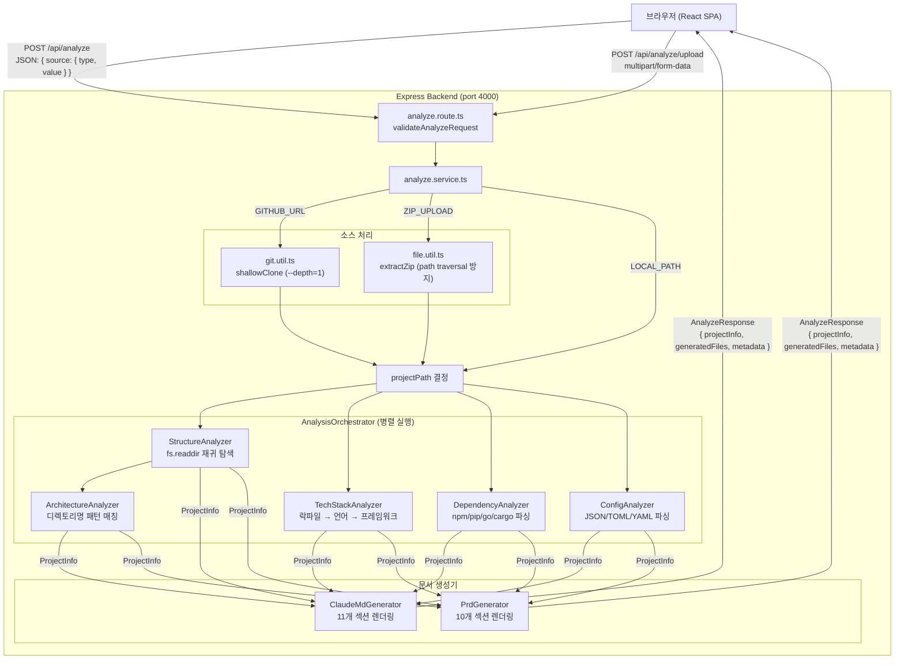

# claudemd-gen

[](https://github.com/rynnkitty/claudemd-gen/actions/workflows/ci.yml)
[](./TESTING.md)
[](https://nodejs.org)
[](./LICENSE)

> GitHub 저장소 또는 로컬 프로젝트를 분석하여 CLAUDE.md와 PRD 초안을 자동 생성하는 웹 애플리케이션

## 왜 필요한가?

AI 코딩 어시스턴트(Claude Code 등)가 프로젝트를 정확히 이해하려면 `CLAUDE.md` 같은 컨텍스트 파일이 필요합니다. 하지만 이 파일을 수동으로 작성하고 최신 상태로 유지하는 것은 번거롭습니다.

**claudemd-gen**은 프로젝트 코드를 정적 분석하여 구조, 기술 스택, 의존성, 아키텍처 패턴을 자동으로 파악하고, 즉시 사용 가능한 CLAUDE.md를 생성합니다. LLM API 없이 오프라인에서도 동작합니다.

## 주요 기능

- **다양한 입력**: GitHub URL, 로컬 경로, ZIP 업로드
- **자동 분석**: 디렉토리 구조, 기술 스택(7개 언어), 의존성, 설정 파일, 아키텍처 패턴 감지
- **문서 생성**: CLAUDE.md (11개 섹션) + PRD 초안 (10개 섹션) 동시 생성
- **실시간 편집**: 생성된 문서를 브라우저에서 바로 수정
- **내보내기**: Markdown 복사 / 파일 다운로드

---

## 아키텍처



---

## 기술 스택

| 레이어 | 기술 |
|--------|------|
| Frontend | React 18, TypeScript, Tailwind CSS, Vite 5 |
| Backend | Node.js 20, Express 4, TypeScript |
| 공유 타입 | npm workspaces (모노레포) |
| 테스트 | Vitest, supertest (커버리지 **95.69%**, 214개 테스트) |
| 인프라 | Docker, Docker Compose, nginx |
| CI/CD | GitHub Actions (lint + type-check + test + coverage) |

---

## 빠른 시작

### Docker로 실행 (권장)

```bash
git clone https://github.com/your-username/claudemd-gen.git
cd claudemd-gen
docker compose up
```

브라우저에서 `http://localhost:3000` 접속

### 로컬 개발 환경

**사전 요구사항:** Node.js 20+, npm 10+

```bash
# 의존성 설치
npm install

# 개발 서버 실행 (프론트엔드 5173 + 백엔드 4000 동시)
npm run dev
```

| 서비스 | URL |
|--------|-----|
| 프론트엔드 (Dev) | http://localhost:5173 |
| 프론트엔드 (Docker) | http://localhost:3000 |
| 백엔드 API | http://localhost:4000 |
| 헬스 체크 | http://localhost:4000/api/health |

---

## API 사용 예시

### GitHub 저장소 분석

```bash
curl -X POST http://localhost:4000/api/analyze \
  -H "Content-Type: application/json" \
  -d '{
    "source": {
      "type": "github_url",
      "value": "https://github.com/expressjs/express"
    }
  }'
```

**응답 예시:**
```json
{
  "projectInfo": {
    "name": "express",
    "description": "Fast, unopinionated, minimalist web framework",
    "techStack": {
      "languages": ["JavaScript"],
      "frameworks": ["Express"],
      "packageManager": "npm",
      "runtime": "Node.js",
      "buildTools": [],
      "testFrameworks": ["mocha"]
    },
    "architecture": {
      "pattern": "mvc",
      "layers": ["lib", "test"]
    }
  },
  "generatedFiles": {
    "claudeMd": "# CLAUDE.md\n\n> 이 파일은 AI 개발 도구...",
    "prdMd": "# PRD: express\n\n## 1. 문제 정의..."
  },
  "metadata": {
    "analyzedAt": "2026-03-15T09:23:41.123Z",
    "fileCount": 142,
    "analysisTimeMs": 1847
  }
}
```

### ZIP 파일 업로드 분석

```bash
curl -X POST http://localhost:4000/api/analyze/upload \
  -F "file=@/path/to/my-project.zip"
```

### 에러 응답 형식

```json
{
  "code": "INPUT_INVALID_URL",
  "message": "GitHub URL 형식이 올바르지 않습니다: https://github.com/user/repo",
  "statusCode": 400
}
```

**에러 코드 목록**: `INPUT_INVALID_URL`, `INPUT_INVALID_PATH`, `INPUT_FILE_TOO_LARGE`, `ANALYSIS_CLONE_FAILED`, `ANALYSIS_TOO_MANY_FILES`, `GENERATE_FAILED`, `SYSTEM_INTERNAL`

---

## 실행 화면

### 메인 화면 — GitHub URL 입력


### 분석 결과 — CLAUDE.md 생성


### 분석 결과 — PRD.md 생성


---

## 프로젝트 구조

```
claudemd-gen/
├── packages/
│   ├── frontend/          # React SPA (Vite)
│   │   └── src/
│   │       └── App.tsx    # 메인 컴포넌트 (입력/로딩/결과 3화면)
│   ├── backend/           # Express API 서버
│   │   └── src/
│   │       ├── analyzers/ # 5개 독립 분석기 + 오케스트레이터
│   │       ├── generators/# CLAUDE.md + PRD 생성기 (순수 함수 기반)
│   │       ├── routes/    # API 라우트
│   │       ├── services/  # 비즈니스 로직
│   │       ├── middlewares/
│   │       └── utils/     # git clone, ZIP 추출
│   └── shared/            # 공유 타입/상수 (API 계약 일원화)
├── docker-compose.yml
├── Dockerfile.frontend    # multi-stage: node → nginx
├── Dockerfile.backend     # multi-stage: node build → node runtime + git
├── .github/workflows/
│   ├── ci.yml             # PR: lint + type-check + test + coverage
│   └── cd.yml             # main merge: Docker 이미지 빌드·GHCR 푸시
├── CLAUDE.md              # AI 컨텍스트 파일
├── PRD.md                 # 제품 요구사항 정의서
├── DEVELOPMENT.md         # 개발 진행 기록 (마일스톤별 기술적 의사결정)
└── TESTING.md             # 테스트 전략 및 커버리지 상세
```

---

## 스크립트

```bash
npm run dev           # 전체 개발 서버
npm run build         # 프로덕션 빌드
npm run test          # 전체 테스트 실행 (214개)
npm run test:unit     # 단위 테스트 (201개)
npm run test:integ    # 통합 테스트 (13개)
npm run lint          # ESLint 검사
npm run type-check    # TypeScript 타입 검사
```

---

## 문서 가이드

| 문서 | 내용 |
|------|------|
| [CLAUDE.md](./CLAUDE.md) | AI 도구를 위한 전체 프로젝트 컨텍스트 |
| [PRD.md](./PRD.md) | 제품 요구사항, 기능 명세, 경쟁 분석 |
| [DEVELOPMENT.md](./DEVELOPMENT.md) | 마일스톤별 기술 결정 및 도전과제 해결 기록 |
| [TESTING.md](./TESTING.md) | 214개 테스트 케이스 목록, 95.69% 커버리지 상세 |

---

## 기여

1. 이슈를 먼저 등록하거나 기존 이슈에 댓글
2. `feat/기능명` 또는 `fix/버그명` 브랜치 생성
3. 변경사항 커밋 (Conventional Commits 형식)
4. PR 생성 → CI 통과 확인 (lint + type-check + test + coverage ≥80%)

---

## 라이선스

MIT License
