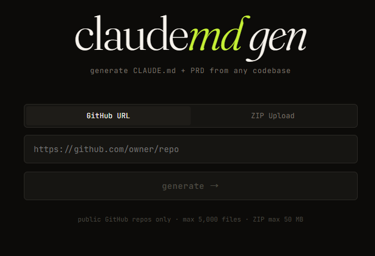
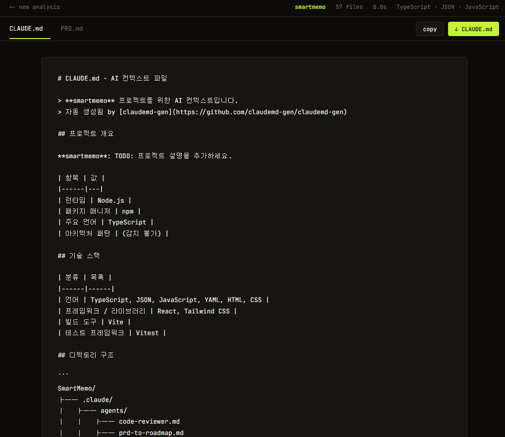
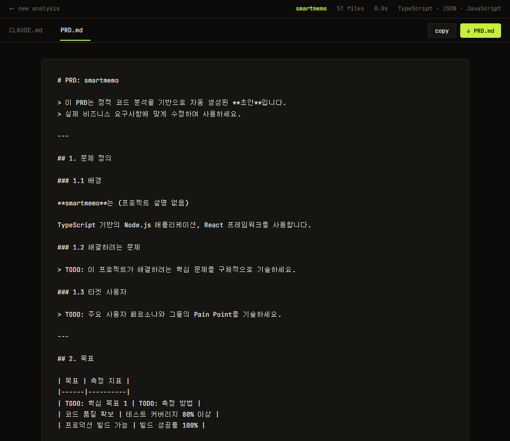

# claudemd-gen

> GitHub 저장소 또는 로컬 프로젝트를 분석하여 CLAUDE.md와 PRD 초안을 자동 생성하는 웹 애플리케이션

## 왜 필요한가?

AI 코딩 어시스턴트(Claude Code 등)가 프로젝트를 정확히 이해하려면 `CLAUDE.md` 같은 컨텍스트 파일이 필요합니다. 하지만 이 파일을 수동으로 작성하고 최신 상태로 유지하는 것은 번거롭습니다.

**claudemd-gen**은 프로젝트 코드를 정적 분석하여 구조, 기술 스택, 의존성, 아키텍처 패턴을 자동으로 파악하고, 즉시 사용 가능한 CLAUDE.md를 생성합니다.

## 주요 기능

- **다양한 입력**: GitHub URL, 로컬 경로, ZIP 업로드
- **자동 분석**: 디렉토리 구조, 기술 스택, 의존성, 설정 파일, 아키텍처 패턴 감지
- **문서 생성**: CLAUDE.md + PRD 초안 자동 생성
- **실시간 편집**: 생성된 문서를 브라우저에서 바로 수정
- **내보내기**: Markdown 복사 / 파일 다운로드

## 기술 스택

| 레이어 | 기술 |
|--------|------|
| Frontend | React 18, TypeScript, Tailwind CSS, Vite |
| Backend | Node.js, Express, TypeScript |
| 테스트 | Vitest, React Testing Library |
| 인프라 | Docker, Docker Compose, GitHub Actions |

## 빠른 시작

### Docker로 실행 (권장)

```bash
git clone https://github.com/your-username/claudemd-gen.git
cd claudemd-gen
docker compose up
```

브라우저에서 `http://localhost:3000` 접속

### 로컬 개발 환경

**사전 요구사항:** Node.js 20+, npm 10+

```bash
# 의존성 설치
npm install

# 개발 서버 실행 (프론트엔드 5173 + 백엔드 4000 동시)
npm run dev
```

| 서비스 | URL |
|--------|-----|
| 프론트엔드 (Dev) | http://localhost:5173 |
| 프론트엔드 (Docker) | http://localhost:3000 |
| 백엔드 API | http://localhost:4000 |
| 헬스 체크 | http://localhost:4000/api/health |

## 실행 화면

### 메인 화면 — GitHub URL 입력


### 분석 결과 — CLAUDE.md 생성


### 분석 결과 — PRD.md 생성


## 사용법

1. 웹 브라우저에서 앱 접속
2. 입력 방식 선택:
   - **GitHub URL**: 퍼블릭 저장소 URL 입력
   - **로컬 경로**: 서버에서 접근 가능한 경로 입력
   - **ZIP 업로드**: 프로젝트 ZIP 파일 드래그 앤 드롭
3. "분석 시작" 클릭
4. 생성된 CLAUDE.md / PRD 미리보기 및 편집
5. 복사 또는 다운로드

## 프로젝트 구조

```
claudemd-gen/
├── packages/
│   ├── frontend/          # React SPA (Vite)
│   ├── backend/           # Express API 서버
│   └── shared/            # 공유 타입/상수
├── docker-compose.yml     # 컨테이너 오케스트레이션
├── Dockerfile.frontend
├── Dockerfile.backend
├── .github/workflows/     # CI/CD 파이프라인
├── CLAUDE.md              # AI 컨텍스트 파일
├── PRD.md                 # 제품 요구사항 정의서
├── DEVELOPMENT.md         # 개발 진행 기록
└── README.md              # 이 파일
```

## 스크립트

```bash
npm run dev           # 전체 개발 서버
npm run build         # 프로덕션 빌드
npm run test          # 전체 테스트 실행
npm run test:unit     # 단위 테스트
npm run test:integ    # 통합 테스트
npm run lint          # ESLint 검사
npm run type-check    # TypeScript 타입 검사
```

## 기여

1. 이슈를 먼저 등록하거나 기존 이슈에 댓글
2. `feat/기능명` 또는 `fix/버그명` 브랜치 생성
3. 변경사항 커밋 (Conventional Commits 형식)
4. PR 생성 → CI 통과 확인

자세한 개발 가이드는 [DEVELOPMENT.md](./DEVELOPMENT.md)를 참고하세요.

## 라이선스

MIT License
